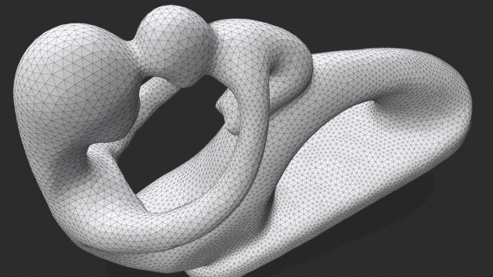

# metriko

Metriko is a header-only C++ library designed for mesh parameterization and quad meshing. It provides a fast and robust method suitable for meshes containing over 10k vertices.

## Why Metriko?

Quad meshing is a technique used to convert triangular meshes into quadrilateral meshes. Quadrilateral meshes are highly desirable in various applications due to their topological and geometric advantages. They perform particularly well in tasks such as animation deformation, uv mapping, and CAD operations.

Many existing quad meshing algorithms rely heavily on Mixed Integer Programming (MIP) or Mixed Integer Non-Linear Programming (MINLP). These approaches typically require commercial solvers such as Gurobi, making them inaccessible to many users. While alternative algorithms exist, some of them are numerically unstable or consumes several hours of computation, and few have publicly available open-source implementations.

Metriko implements the Quantized Global Parameterization (QGP) algorithm, providing fast and robust quadrilateral parameterization. The algorithm guarantees a valid result and scales linearly with the number of vertices.

## Current Features and Limitations
Metriko is currently in early development. Available features include:
- Globally optimal rotational symmetry tangent fields
- Basic integration of tangent fields
- Integer Grid Mapping (IGM) using an iterative rounding algorithm
- T-mesh implementation based on the motorcycle graph
- Quantization and mesh generation using T-mesh

Known limitations and issues:
- Quantization results can vary in quality for coarse quads
- Meshes with boundaries are currently not supported (planned for future support)
- While quantization is robust, the meshing technique is not yet optimized for coarse quads

## Usage
Metriko is a header-only library with a minimal dependency on libigl (only the core features are required). To run a demo, install Polyscope using the submodule system provided.

## References
- Campen, M., Bommes, D., Kobbelt, L. 2015. Quantized global parametrization. ACM Trans. Graph 34(6), 192:1–192:12. DOI: [10.1145/2816795.2818140](https://doi.org/10.1145/2816795.2818140)

-  BOMMES, D., ZIMMER, H., AND KOBBELT, L. 2009. Mixedinteger quadrangulation. In Proc. SIGGRAPH 2009, 1–10. DOI: [10.1007/978-3-642-11620-9_5](https://doi.org/10.1007/978-3-642-11620-9_5)

- BOMMES, D., CAMPEN, M., EBKE, H.-C., ALLIEZ, P., AND KOBBELT, L. 2013. Integer-grid maps for reliable quad meshing. In Proc. SIGGRAPH 2013, 98:1–98:12. DOI: [10.1145/2461912.2462005](https://doi.org/10.1145/2461912.2462005)

- Knöppel, F., Crane, K., Pinkall, U. & Schröder, P. 2013 Globally optimal direction fields. ACM Trans. Graph. 32, 1–10. DOI: [10.1145/2461912.2462005](https://doi.org/10.1145/2461912.2462005)

- EPPSTEIN, D., GOODRICH, M. T., KIM, E., AND TAMSTORF, R. 2008. Motorcycle Graphs: Canonical Quad Mesh Partitioning. Computer Graphics Forum 27, 5, 1477–1486. DOI: [10.1111/j.1467-8659.2008.01288.x](https://doi.org/10.1111/j.1467-8659.2008.01288.x)