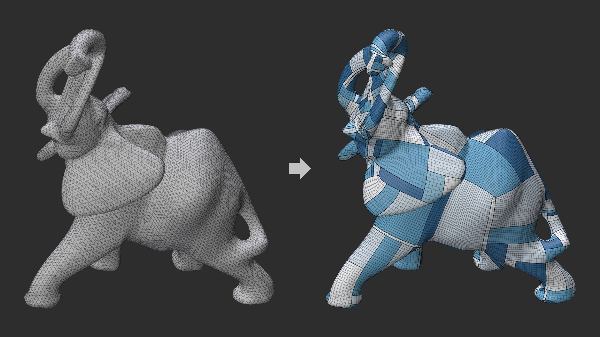

# metriko


Metriko is a header-only C++ library designed for mesh parameterization and quad meshing. It provides a fast and robust method suitable for meshes containing over 100k vertices.

## Why Metriko?

Quad meshing is a technique used to convert triangular meshes into quadrilateral meshes. Quadrilateral meshes are highly desirable in various applications due to their topological and geometric advantages. They perform particularly well in tasks such as animation deformation, uv mapping, and CAD operations.

Many existing quad meshing algorithms rely heavily on Mixed Integer Programming (MIP) or Mixed Integer Non-Linear Programming (MINLP). These approaches typically require commercial solvers such as Gurobi, making them inaccessible to many users. While alternative algorithms exist, some of them are numerically unstable or consumes several hours of computation, and few have publicly available open-source implementations.

Metriko implements the Quantized Global Parameterization (QGP) algorithm, providing fast and robust quadrilateral parameterization. The algorithm guarantees a valid result and scales linearly with the number of vertices.

## Current Features and Limitations
Metriko is currently in early development. Available features include:
- Globally optimal rotational symmetry tangent fields
- Basic integration of tangent fields
- Integer Grid Mapping (IGM) using an iterative rounding algorithm
- T-mesh implementation based on the motorcycle graph
- Quantization and mesh generation using T-mesh
- Extraction of a quad mesh(QEx) from a locally-injective uv map

Known limitations and issues:
- Quantization results can vary in quality for coarse quads
- Meshes with boundaries are currently not supported (planned for future support)
- While the quantization is robust, the meshing technique is not yet optimized for coarse quads. The reparameterization scheme described in Lyon et al. (2021) is currently under implementation.

## Usage
Metriko is a header-only library with a minimal dependency on libigl (only the core features are required). To run a demo, install viewer (polyscope), and execute the following commands:
```
git submodule update --init --recursive
cd example
mkdir build && cd build
cmake .. 
make
./metriko_example ../models/icosphere.obj 0.03
```
If SuiteSparse is installed on your machine, it will be automatically integrated via CMake, providing significantly faster matrix computations compared to Eigen.

## Benchmark
End-to-end remeshing time (field → IGM → quantization → T-mesh → reparameterization → QEx) with the smoothest cross field. Preliminary numbers; performance work is ongoing.

| Mesh | #V | #F | Grid scale | #Quads | Time |
|---|--:|--:|--:|--:|--:|
| spot | 2.9k | 5.9k | 0.01 | 8.0k | 1.3 s |
| fandisk | 6.5k | 12.9k | 0.01 | 10.0k | 1.1 s |
| horsers | 3.0k | 6.0k | 0.005 | 20.7k | 1.9 s |
| rocker-arm | 10.0k | 20.1k | 0.01 | 9.1k | 4.6 s |
| bunny | 14.3k | 28.6k | 0.01 | 8.9k | 4.7 s |
| elephant | 12.4k | 24.7k | 0.005 | 25.0k | 5.0 s |
| rolling_stage | 12.4k | 24.9k | 0.005 | 40.2k | 5.5 s |
| gargoyle | 26.0k | 51.9k | 0.005 | 34.7k | 10.3 s |

Measured on Apple M5 (32 GB) with SuiteSparse, `-O2`, via `ctest` running 4 tests in parallel.

## References
- Bommes et al. [Mixed-integer quadrangulation](https://doi.org/10.1145/1531326.1531383). SIGGRAPH 2009.
- Bommes et al. [Integer-grid maps for reliable quad meshing](https://doi.org/10.1145/2461912.2462014). SIGGRAPH 2013.
- Campen et al. [Quantized global parametrization](https://doi.org/10.1145/2816795.2818140). SIGGRAPH Asia 2015.
- Ebke et al. [QEx: Robust quad mesh extraction](https://doi.org/10.1145/2508363.2508372). SIGGRAPH Asia 2013.
- Eppstein et al. [Motorcycle graphs: canonical quad mesh partitioning](https://doi.org/10.1111/j.1467-8659.2008.01288.x). SGP 2008.
- Knöppel et al. [Globally optimal direction fields](https://doi.org/10.1145/2461912.2462005). SIGGRAPH 2013.
- Lyon et al. [Parametrization quantization with free boundaries for trimmed quad meshing](https://doi.org/10.1145/3306346.3323019). SIGGRAPH 2019.
- Lyon et al. [Quad layouts via constrained T-mesh quantization](https://doi.org/10.1111/cgf.142634). Eurographics 2021.
- Myles et al. [Robust field-aligned global parametrization](https://doi.org/10.1145/2601097.2601154). SIGGRAPH 2014.
